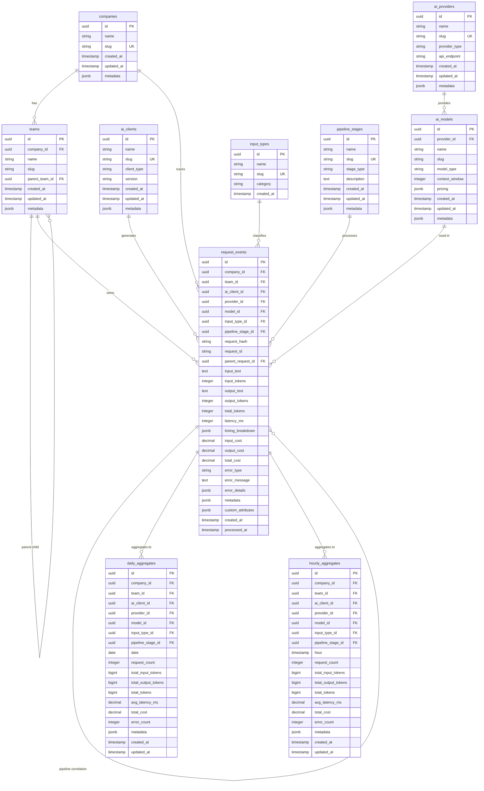

# Entity Relationship Diagram



## Key Relationships

### Core Dimensional Relationships
- **Companies → Teams**: One-to-many hierarchy for organizational structure
- **Teams → Request Events**: Many-to-one for team-based analytics
- **AI Clients → Request Events**: Many-to-one for client-based tracking
- **AI Providers → AI Models**: One-to-many for provider model catalog
- **AI Models → Request Events**: Many-to-one for model-specific analytics
- **Input Types → Request Events**: Many-to-one for input classification
- **Pipeline Stages → Request Events**: Many-to-one for pipeline analytics

### Self-Referential Relationships
- **Request Events → Request Events**: Parent-child relationship for pipeline correlation (e.g., pre-optimization → post-optimization)

### Aggregation Relationships
- **Request Events → Daily Aggregates**: One-to-many for pre-computed daily statistics
- **Request Events → Hourly Aggregates**: One-to-many for real-time hourly statistics

## Query Patterns Supported

### Dimensional Filtering
```sql
-- Filter by company
SELECT * FROM request_events WHERE company_id = ?;

-- Filter by team
SELECT * FROM request_events WHERE team_id = ?;

-- Filter by AI client
SELECT * FROM request_events WHERE ai_client_id = ?;

-- Filter by provider
SELECT * FROM request_events WHERE provider_id = ?;

-- Filter by model
SELECT * FROM request_events WHERE model_id = ?;

-- Multi-dimensional filter
SELECT * FROM request_events 
WHERE company_id = ? 
  AND provider_id = ? 
  AND model_id = ? 
  AND created_at >= ? 
  AND created_at <= ?;
```

### Pipeline Correlation
```sql
-- Track request through pipeline stages
SELECT * FROM request_events 
WHERE request_hash = ? 
ORDER BY created_at;

-- Find parent-child relationships
SELECT parent.*, child.* 
FROM request_events parent
JOIN request_events child ON parent.id = child.parent_request_id
WHERE parent.request_id = ?;
```

### Time-Series Analytics
```sql
-- Daily aggregation from pre-computed table
SELECT * FROM daily_aggregates
WHERE company_id = ? 
  AND date >= ? 
  AND date <= ?;

-- Hourly real-time analytics
SELECT * FROM hourly_aggregates
WHERE model_id = ? 
  AND hour >= ? 
  AND hour <= ?;
```

### Cost Analysis
```sql
-- Cost by provider
SELECT provider_id, SUM(total_cost) as total_cost
FROM request_events
WHERE created_at >= ? AND created_at <= ?
GROUP BY provider_id;

-- Cost by model
SELECT model_id, SUM(total_cost) as total_cost, AVG(total_cost) as avg_cost
FROM request_events
WHERE created_at >= ? AND created_at <= ?
GROUP BY model_id;
```

## Performance Optimizations

### Index Coverage
- All foreign keys have indexes
- Composite indexes for common query patterns
- Time-series indexes for date range queries
- Hash indexes for request correlation

### Query Optimization
- Use aggregation tables for summary queries
- Leverage composite indexes for multi-dimensional filters
- Partition by date for large time-series data
- Materialized views for complex aggregations